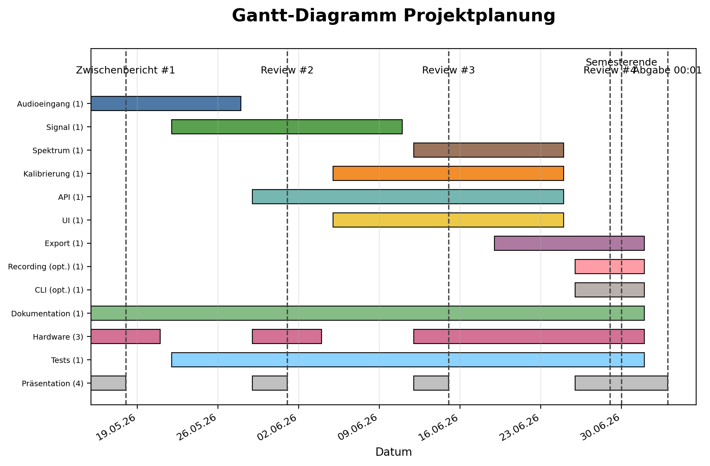

# SPL‑Meter – Anforderungen & Umsetzung

Anforderungen aus `W3/Anforderungen.md`, Pläne aus `W4/Vorschläge_anforderungen.ipynb`.

Legende: 🙂 leicht · 😐 mittel · 😓 anspruchsvoll · 😵 kritisch

---

# Beispiel aus unseren Anforderungen: 
- ID: REQ-FUNC-001
   Titel: Digitaler Audioeingang (USB oder I2S)
   Priorität: MUSS
   Beschreibung: Das System verarbeitet in Echtzeit ein digitales Audiosignal eines angeschlossenen Mikrofons über USB (UAC) oder I2S.
   Akzeptanzkriterium/Test: Bei 48 kHz/24 bit kontinuierliche Rahmenverarbeitung ohne Buffer-Underruns über ≥5 Minuten; Quelle/Interface wird erkannt und ausgewählt.
   Quelle: Meeting Zeilen 7–9

 - ID: REQ-FUNC-002
   Titel: Echtzeit-SPL-Berechnung
   Priorität: MUSS
   Beschreibung: Das System berechnet kontinuierlich SPL-Kennwerte aus dem Audiostream in quasi-Echtzeit.
   Akzeptanzkriterium/Test: Sichtbar flüssige Aktualisierung in der GUI; Log zeigt keine Verarbeitungsüberläufe bei 48 kHz/24 bit über ≥5 Minuten.
   Quelle: Meeting Zeilen 8

 - ID: REQ-FUNC-003
   Titel: Zeitbewertungen (F, S) und Leq
   Priorität: MUSS
   Beschreibung: Das System stellt Zeitgewichtungen „Fast (F)“ und „Slow (S)“ sowie die energieäquivalente Größe Leq bereit gemäß IEC 61672.
   Akzeptanzkriterium/Test: Verifikation der Zeitkonstanten über Testsignale gemäß IEC 61672-2; Leq über definierte Testdauer korrekt.
   Quelle: Meeting Zeilen 9, 21–26

---

| Anforderung | Unser Plan | S |
|---|---|---|
| Das System verarbeitet den digitalen Audioeingang (USB oder I2S) in Echtzeit. | INMP441 via I2S; Kernel-Overlay aktivieren; ALSA `hw:0,0` / sounddevice testen | 😐 |
| Das System berechnet kontinuierlich SPL‑Kennwerte in quasi‑Echtzeit aus dem Audiostream. | Blockweise RMS/SPL; Verarbeitungs-Thread von GUI entkoppeln (Queue) | 😐 |
| Das System stellt die Zeitgewichtungen Fast und Slow sowie den energieäquivalenten Pegel Leq gemäß IEC 61672 bereit. | Vektorisierte Filter (NumPy/SciPy); ggf. Cython/Numba; bei Bedarf Pi Zero 2 | 😓 |
| Das System unterstützt die Frequenzbewertungen A und Z. | IIR-Filter mit verifizierten Koeffizienten implementieren | 😐 |
| Das System liefert bandbegrenzte Pegel in Oktav‑ und Terzbändern. | Filterbank; ggf. reduzierte Bänder oder Downsampling | 😵 |
| Eine leichtgewichtige Web‑GUI stellt Live‑Werte, Start/Stop, Konfiguration und Export bereit. | Streamlit-Minimal-UI: Live-Werte, Start/Stop, Konfiguration | 🙂 |

---

| Anforderung | Unser Plan | S |
|---|---|---|
| Mess‑ und Metadaten können als JSON exportiert werden. | Dataclass-Schema + Export; gegen JSON-Schema validieren | 🙂 |
| Das System unterstützt die Kalibrierung mit 94 dB bei 1 kHz und speichert den Kalibrierfaktor. | Kalibrier-Workflow in GUI; Faktor speichern; Button + LED optional | 😐 |
| Das System bietet zusätzlich eine CLI/TUI zur lokalen und entfernten Steuerung. | HTTP-API + schlanker CLI-Client (SSH/seriell) | 🙂 |
| Die Messung kann optional parallel als Audiodatei aufgezeichnet werden. | Ringpuffer + Schreib-Thread; WAV-Streaming | 😐 |
| Das System stellt eine Schnittstelle zur Integration in „tapy“ bereit. | Bibliothek klären; Minimal-API definieren; PoC erstellen | 😐 |

---

| Anforderung | Unser Plan | S |
|---|---|---|
| Das System unterstützt Abtastraten bis einschließlich 48 kHz stabil und ohne Underruns. | Blockgröße 2048–4096; NumPy vektorisiert; Audio-Prozess priorisieren; GUI entkoppeln | 😐 |
| Die externe Wortbreite beträgt 24 Bit; intern wird in 32 Bit berechnet. | 24‑bit in; intern float32 (2^31 Normierung); keine Überläufe | 🙂 |
| Es wird keine automatische Pegelregelung (AGC) eingesetzt; der Gain ist fest definiert. | Fester Gain; Review/Tests sichern, dass keine AGC aktiv ist | 🙂 |
| Steuerung und Datenausgabe sind über WLAN/SSH und USB‑seriell möglich. | WiFi/SSH + USB CDC; Steuerung via HTTP‑API | 🙂 |
| Der integrierte WiFi‑Chip des Pi Zero W wird für GUI‑ und Remote‑Zugriff genutzt. | Pi Zero 2W WLAN für GUI/SSH nutzen | 🙂 |
| Exportierte Dateien enthalten eine Prüfsumme zur Integritätsprüfung. | Sidecar .sha256 erzeugen; Prüfsummen‑CLI bereitstellen | 🙂 |

---

| Anforderung | Unser Plan | S |
|---|---|---|
| Das System speichert 12 h SPL‑Messdaten effizient; optional mit Delta‑Encoding. | 12h SPL bei 10 Hz < 50 MB; optional Delta‑Encoding/Kompression | 🙂 |
| USB‑Betrieb ist unterstützt; optional ermöglicht Akkubetrieb eine Laufzeit von mindestens 12 Stunden. | USB‑Betrieb; Option Powerbank ≥12 h | 🙂 |
| Ein einfaches Gehäuse schützt die Elektronik und hält Anschlüsse zugänglich. | Einfaches 3D‑Druck‑Gehäuse (Schutz, Anschlüsse frei) | 🙂 |
| Am Gerät ist kein dediziertes Display vorgesehen; die GUI ist ausschließlich webbasiert. | Nur Web‑GUI; headless Start | 🙂 |
| Das System ist für ein einzelnes Mikrofon ohne Richtcharakteristikkompensation ausgelegt. | Single‑Channel ohne Richtkompensation | 🙂 |
| Die implementierten Zeitgewichtungen sind konform zu IEC 61672‑2. | Prüfungen gemäß IEC 61672‑2; Toleranzen verifizieren | 😓 |

---

| Anforderung | Unser Plan | S |
|---|---|---|
| Das System implementiert eine robuste Zustandsmaschine mit definierten Zuständen und Übergängen. | transitions‑Lib; PlantUML‑Diagramm; robuste Übergänge | 🙂 |
| Für wesentliche Substates existieren Diagnosefunktionen mit PASS/FAIL‑Ergebnis. | Substate‑spezifische Selbsttests (Audio, Latenz, Storage) | 😐 |
| Fehler werden erkannt, geloggt und führen zu definierten Degradations‑ oder Recovery‑Maßnahmen. | Fehlerklassen + Recovery (Retry, Idle, Logs) | 😐 |
| Messergebnisse werden gegen ein Referenzgerät (NTi XL2) innerhalb definierter Toleranzen validiert. | Tests gegen NTi XL2; Ziel ≤ ±1 dB | 😐 |
| Die Entwicklung erfolgt in zweiwöchigen Iterationen mit Review‑Meetings und funktionsfähigen Inkrementen. | 2‑wöchige Sprints, Reviews, Inkremente | 🙂 |
| Das Projekt nutzt ein offenes Lizenzmodell; die finale Lizenz wird festgelegt. | Vorschlag: MIT; finale Entscheidung dokumentieren | 🙂 |

---

## Jeder Anforderung hat eine ID. 
## Zu den Anforderungen wurden Lösungvorschläge gesammelt.
## Aus den Lösungvorschlägen ergeben sich die Features und Epics.
## Durch die IDs kann nun eine gute Nachvollziehbarkeit gewährleistet werden. 

---
# Bespiel aus unserer Aufgabenaufteilung
## EP-UI Web‑GUI

- **FEAT-AUD-001 `init_audio_stream(samplerate, blocksize, dtype, device)`**
  - Beschreibung: Öffnet I2S/USB-Eingang (48 kHz/24 bit), setzt Low-Latency-Parameter.
  - Abhängigkeiten: –
  - Aufwand: 4 h
  - Anforderungen: REQ-FUNC-001, REQ-PERF-001, REQ-PERF-002
  - Bibliotheken: sounddevice, numpy

- **FEAT-AUD-002 `audio_callback(in_data, frames, time, status)`**
  - Beschreibung: Producer-Callback; wandelt 24→32-bit float, schreibt non-blocking in Ringpuffer; zählt Underruns.
  - Abhängigkeiten: FEAT-AUD-003, FEAT-AUD-005
  - Aufwand: 4 h
  - Anforderungen: REQ-FUNC-001, REQ-QUAL-001
  - Bibliotheken: sounddevice, numpy, queue (Stdlib)

---

## 

---
# Beispiel für den Zeitplan
### EP‑CAL Kalibrierung 94 dB @ 1 kHz
- FEAT‑CAL‑001 – detect_cal_tone_1khz(blocks, fs) – 05.06.2026 → 11.06.2026 – Benötigt SIG/FFT‑Pfad.
- FEAT‑CAL‑002 – compute_cal_factor – 12.06.2026 → 18.06.2026 – Auf CAL‑001 basierend.
- FEAT‑CAL‑003 – save_calibration – 12.06.2026 → 18.06.2026 – Persistenz.
- FEAT‑CAL‑004 – load_calibration – 12.06.2026 → 18.06.2026 – Fallback/Validierung.
- FEAT‑CAL‑005 – apply_calibration – 12.06.2026 → 18.06.2026 – In SPL‑Pfad integrieren.
- FEAT‑CAL‑006 – detect_cal_tone_1khz(window_s) (API‑gestützt) – 12.06.2026 → 18.06.2026 – Binding vorbereiten.
- FEAT‑CAL‑007 – calibrate_auto – 19.06.2026 → 25.06.2026 – End‑to‑End Auto‑Kalibrierung.
---

---
---